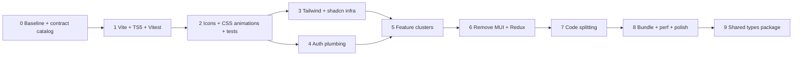

# Frontend Migration Plan (Revised)

*2026-08-11 — supersedes the original plan. All baseline facts verified against the codebase. Corrections and user decisions incorporated below.*

*2026-09-04 — factual corrections applied (backend migration status, auth-refresh decision resolved, 5b cluster scope). See [frontend-reimplementation-study.md](./frontend-reimplementation-study.md) for a comparative evaluation of full re-implementation, which includes a final review of this plan.*

---

## 0. Scope & governing principles

### 0.1 Why this revision

The original plan had the right direction but three factual errors and three structural weaknesses:

| Area | Original claim | Verified reality |
|------|---------------|------------------|
| Auth | "axios interceptors catch 401, attempt refresh" | No interceptors exist. 10 services hand-build `Authorization: Bearer ${token}` from `thunkAPI.getState().auth.user.token`. No refresh mechanism. |
| Auth | "Token storage moves from Redux authSlice to Zustand" | `localStorage['user']` is the durable store. Redux is a mirror hydrated at module load. AuthVerify reads localStorage directly. |
| Guards | "Protected routes likely use `<Route element={user ? Outlet : Navigate}>`" | No ProtectedRoute exists. Guards are per-page `useEffect`s (Dashboard, AddWord, Review). Practice, Account, NotificationHub render unauthenticated — a live hole. |
| Proxy port | `localhost:5000` | `http://localhost:5001` |
| Backend | "Presumably Flask/Go" | Node/Express + Mongoose, mid-migration to Postgres + Drizzle (see `../migration-plan.md`). It's already a monorepo. |
| Monorepo | "If both live in this repo" | `backend/` + `frontend/` share a root with shared CI. |
| Testing | "No test setup" | True (zero test files), but `@testing-library/react`/jest-dom/user-event are already installed. CI runs only backend tests. |

Structural weaknesses the revision fixes:

1. **Auth sequencing:** every thunk reads `state.auth.user.token`. Auth was last (4e), but no cluster can migrate without a token source outside Redux. Fix: **auth plumbing becomes its own early phase (Phase 4)**, with token storage in Zustand + one shared axios client with a request interceptor. The auth *UI* (login/register forms, guards, Header auth) moves last (5f).

2. **Migration unit:** the original plan's 4a–4i table treated slices as independent. They're not. Header reads auth+words+notifications+tags. FriendSearchModal reads 5 slices. TagDataForm reads 4. Fix: **migration unit is page clusters**, ordered by a dependency DAG (metrics → social: users+notifications+friendships → tags → words+autocompletedTranslations → exercises+exercisePerformance → auth UI).

3. **Testing infra:** the plan's §6.3 said "write tests even before Phase 1" but the phase table put testing at Phase 3. Fix: **Vitest ships in Phase 1 (same toolchain as Vite); pure-util tests + MSW scaffold in Phase 2; characterization tests per cluster in Phase 5.**

### 0.2 Five governing principles

1. **Gate = automated verification.** A phase is done when its CI + integration tests + grep checks pass, full stop. No "looks done."
2. **Characterization tests before change.** Write an MSW-based test that pins current behavior, watch it pass against the old code, keep it green through the swap. Tests are UI-agnostic (click button, type input, read output) — they survive MUI→shadcn.
3. **One-pass rule.** Data reads switch cluster by cluster (TanStack hooks work inside MUI — they're UI-agnostic). UI conversion of a shared component happens *once*, when its last consumer converts. Header: data reads switch per cluster, UI converts in 5f (auth UI — its last slice).
4. **Always shippable.** Every phase ends with the app deployable. Rollback = revert that phase's commits. Phases are small, in 1–3 commits each.
5. **Contract pinned to the live backend.** The backend is migrating concurrently. Type against what the API actually returns; re-pin per cluster.

### 0.3 User decisions (locked)

| # | Decision | Effect on the plan |
|---|----------|-------------------|
| 1 | **Backend migration is complete and live** *(verified 2026-09-04: Express + Postgres/Drizzle with TS controllers running via `backend/api/index.js`; only legacy Mongoose-file cleanup remains).* | Phase 0 contract catalog → written against the live Drizzle API directly. No contract-drift window. |
| 2 | **Auth refresh: 401→logout ships; refresh-ready structure only.** *(Verified 2026-09-04: no refresh endpoint exists on the live backend; the TOKENS table serves email-verification/password-reset, not JWT refresh.)* | Phase 4 interceptor does `clearSession()` + redirect `/login` on 401, with a documented-but-disabled retry-once leg so a future backend refresh endpoint is a config change. |
| 3 | **Animations: CSS preferred.** Replace where cheap; defer to polish where JS-driven. | Phase 2 replaces page route transitions (routeVariantsAnimation/childVariantsAnimation) with a CSS keyframe — mechanical per page. `motion` stays in deps temporarily for SpinningText (useSpring reel) and ImageCarousel (AnimatePresence crossfade); their CSS rewrite is deferred to Phase 8 polish. |
| 4 | **Shared types: yes, kept last.** | Phase 9 (`packages/contracts`). Per-cluster typing stays frontend-local during migration; final consolidation derives from the backend Drizzle schema. |

Defaults applied (flippable): shadcn/Base UI primitives; c3/D3 charts kept + code-split; guards centralized + unauthenticated pages fixed in 5f; 401→logout added (new behavior — today a 401 just surfaces an error toast and leaves the user stuck).

---

## 1. Current baseline (verified 2026-08-11)

### 1.1 Stack

| Metric | Value |
|--------|-------|
| React | 18.2 |
| TypeScript | 4.7.4 |
| Build tool | Create React App 5.0.1 (react-scripts) |
| State | Redux Toolkit 1.8.3 (10 slices) |
| UI | MUI 5.9 + emotion/styled |
| Animation | framer-motion 10.13 |
| Icons | react-icons + @mui/icons-material |
| HTTP client | axios 1.3.4 (no interceptors — token plumbed per-request) |
| Forms | react-hook-form 7.43 + yup 1.0 + MUI form bridges (TextInputFormHook, SelectFormHook, RadioGroupFormHook, CheckboxGroupFormHook) |
| Tables | @tanstack/react-table 8.9 |
| Charts | c3 0.7 + D3 7.4 |
| DnD | @dnd-kit 6 |
| Notifications | react-toastify 9 |
| i18n | i18next 23 (4 languages × 11 namespaces) |
| Routing | React Router 6.8 (13 routes, all statically imported in RoutesWithAnimation) |
| Testing | 0 tests; @testing-library/react 13, jest-dom, user-event installed; CI runs only backend tests (root `jest.config.js`) |
| Auth | JWT in `localStorage['user']`; AuthVerify checks expiry on route change; no refresh mechanism; guards are per-page `useEffect`s (Dashboard/AddWord/Review) |
| Proxy | `http://localhost:5001` |
| Bundle | ~500–800KB gzipped (estimate — to be measured in Phase 0) |
| Files | ~44 components/, 17 pages/, 74 files importing @mui, 17 using framer-motion |
| Env vars | `REACT_APP_ENVIRONMENT_NAME`, `REACT_APP_ITERATION`, `REACT_APP_VERCEL_BE_URL`, `PUBLIC_URL` |

### 1.2 Dependencies that stay

| Library | Why |
|---------|-----|
| React Router 6 | Best fit for an authenticated SPA; NextJS adds complexity for zero benefit (all content is behind login). Pair with Vite, not NextJS. |
| axios | Consolidated into one shared client instance in Phase 4; implementation detail behind TanStack Query. |
| react-hook-form + yup | Already integrated, unopinionated about UI. shadcn/ui has RHF form primitives — the form-hook bridge components get rebuilt once. |
| @tanstack/react-table | Table logic independent of UI. |
| @dnd-kit | Drag-and-drop primitives, MUI-agnostic. |
| react-toastify | Lightweight, framework-agnostic. Note: toasts currently fire inside services/slices (moved to TanStack mutation callbacks in Phase 5). |
| i18next | Works with any UI. No MUI date pickers exist — no localization to replace. |
| c3 + D3 | Charts are isolated to Dashboard; code-split in Phase 7. |
| @testing-library/react, jest-dom, user-event | Already installed. Used by Vitest. |

### 1.3 Dependencies to remove

| Library | Replacement |
|---------|-------------|
| Redux Toolkit + react-redux | TanStack Query (server state) + Zustand (client state) |
| MUI v5 + emotion/styled | shadcn/Base UI + Tailwind CSS |
| react-icons + @mui/icons-material | @phosphor-icons/react |
| framer-motion | CSS animations (route transitions) + motion kept temporarily for SpinningText/ImageCarousel until Phase 8 polish |
| @babel/plugin-proposal-private-property-in-object | Removed with CRA (Vite doesn't need it) |
| @tsconfig/create-react-app | Replaced by Vite tsconfig |

---

## 2. Library decisions (short verdicts)

- **No NextJS** (original §1). This is an authenticated SPA. SSR provides no SEO benefit; the backend handles all API concerns. Keep React Router 6 + Vite.
- **Partial Redux removal** (original §2). Server state → TanStack Query (words, tags, exercises, notifications, etc.). Client state → Zustand (auth session, UI state like selected PoS). Auth plumbing (Phase 4) splits the auth work into plumbing (early) and UI (last).
- **MUI → shadcn/Base UI + Tailwind** (original §3). Zero-runtime CSS, copy-paste ownership, smaller bundle. The real cost is Grid→Tailwind layout and `sx`→className translation (74 files, every page uses a Grid tree).
- **Keep axios** (original §4). Consolidated into one `api/client.ts` instance with a request interceptor (Phase 4). Easy to swap later.
- **Phosphor Icons** (original §5). Mechanical codemod in Phase 2.
- **Motion → CSS** where trivial, keep where JS-driven (Decision 3). Route page transitions = CSS keyframe (Phase 2). SpinningText (useSpring reel) + ImageCarousel (AnimatePresence) deferred to Phase 8 polish.
- **i18n untouched** (original §6.7). No MUI date-pickers to replace; no new libraries needed. `useTranslation()` calls survive all UI changes.

---

## 3. Migration order



| Phase | Scope | Effort | Risk | Rollback |
|-------|-------|--------|------|----------|
| **0** | Baseline measurement + endpoint contract catalog + behavioral inventory | 1–2d | Low | No code touched |
| **1** | CRA → Vite + TS 5.x + Vitest + CI frontend job | 2–3d | Medium — build tooling | Revert config; react-scripts stays |
| **2** | Icons → Phosphor; route animations → CSS; pure-util tests; MSW scaffold | 1–2d | Low | Revert import commits |
| **3** | Tailwind v4 + shadcn/Base UI primitives + design-token bridge + coexistence rules | 2–3d | Medium — style conflicts | Remove Tailwind config |
| **4** | Auth plumbing: Zustand authStore + shared axios client + request interceptor + 401 handler; refresh-ready | 1–2d | High — everything depends on it | Revert plumbing; authSlice intact |
| **5** | Per-cluster state+UI migration (5a–5f) | 4–6w | High | Per cluster: revert that cluster's commits |
| **6** | Remove MUI/emotion/styled; flip Tailwind preflight on; delete Redux/RTK | 1–2d | Low | Keep deps in package.json |
| **7** | Route-level code splitting | 0.5–1d | Low | Revert lazy() imports |
| **8** | Bundle analysis + performance budget + staleTime policy + polish backlog | 1–2d | Low | Remove visualizer plugin |
| **9** | Shared types package (`packages/contracts`) | 1–2d | Medium | Revert workspace config |

---

## 4. Phase detail

### Phase 0 — Baseline & contract catalog *(new; 1–2d)*

**Goal:** Make every later phase measurable and every API contract explicit.

**Steps:**
1. Run CRA production build. Record bundle sizes (source-map-explorer), dev-server startup, prod build time.
2. **Endpoint contract catalog.** Enumerate every call in the 10 services (~50 endpoints across `authService`, `wordService`, `tagService`, `notificationService`, `friendshipService`, `userService`, `metricService`, `autocompletedTranslationService`, `exerciseService`, `exercisePerformanceService`): method, path, auth requirement, request/response shapes. Written against the live backend (Postgres + Drizzle is the running stack — verified 2026-09-04). Verified endpoint count: 54. Note: two routes carry backend TODOs questioning their removal (`GET /api/tags/filterTags`, `GET /api/words/getAllWordDataByWord`) — confirm their status before pinning.
3. **Behavioral inventory** (things a migration silently breaks):
   - Notification polling: 90s interval + immediate first fetch via `useIntervalFunction` in MainView.
   - Toast calls inside services/slices: `authService` toasts info on verify; slices toast errors in `rejected` handlers.
   - Per-page guard behavior: Dashboard/AddWord/Review redirect on `!user`; **Practice, Account, NotificationHub, DisplayTag do not guard** (known bug — fix in 5f).
   - Env vars: `REACT_APP_ENVIRONMENT_NAME`, `REACT_APP_ITERATION`, `REACT_APP_VERCEL_BE_URL` (re-read in 8 services), `PUBLIC_URL` (flag images).
   - `localStorage['user']` read at `authSlice` module init + `AuthVerify` direct read.
4. Record current CI status (green? pass/fail).

**Gate:** Contract catalog + inventory committed as `.context/.frontend/contracts-and-behavior.md`. Baseline numbers recorded. Zero changes to `src/`.

---

### Phase 1 — Vite + TS 5.x + Vitest *(plan's original phase 0 + 6.2 + half of 6.3; 2–3d)*

**Goal:** New toolchain, zero component-code changes, CI guarding the frontend build.

**Steps:**
1. **Create `src/env.ts`** — single module owning all env access. Maps `VITE_ENVIRONMENT_NAME`, `VITE_ITERATION`, `VITE_VERCEL_BE_URL`, and `BASE_URL` (replaces `PUBLIC_URL` — watch trailing-slash semantics: CRA `PUBLIC_URL` is `''` by default; Vite `BASE_URL` is `'/'`). Every other file imports from here. This makes the env swap a one-file change and testable.
2. Install `vite`, `@vitejs/plugin-react`, `typescript@^5`, `@types/react@^18`.
3. `vite.config.ts`: `server.proxy: {'/api': 'http://localhost:5001'}`, `resolve` (none needed — tsconfig has no baseUrl).
4. Move `public/index.html` → root `index.html`; convert `%PUBLIC_URL%` and `%REACT_APP_*%` template tags to no-ops (Vite handles assets via `import` or `public/` directly).
5. **tsconfig rewrite:** `module: esnext`, `moduleResolution: bundler`, `target: es2020`, keep `jsx: "react"` (classic — every file already imports React; zero churn), **keep `noImplicitAny: false`** (typing is a Phase 5 per-cluster workstream; flipping now would surface hundreds of errors mid-toolchain-swap), add `"types": ["vite/client"]`, drop `@tsconfig/create-react-app` and the Babel private-methods workaround.
6. **Install Vitest** + jsdom + @testing-library/jest-dom setup. Wire `vitest.config.ts`. Add a trivial smoke test (`expect(true).toBe(true)`) to prove the runner works. Now, not later.
7. **Update `.github/workflows/test.yml`:** node matrix 16/18 → 18/20. Add a frontend job: `cd frontend && npm ci && npm run build && npm test`.
8. Verify: no v3-era landmines trigger. No `ReactComponent` SVG imports (confirmed — none exist, so no `vite-plugin-svgr` needed). No Node globals (no `Buffer`; `window.atob` is fine).

**Gate:** dev server HMR works; prod build succeeds; login flow works in dev (proxy → :5001) and against the VERCEL_BE_URL; TS 5 type-check passes; bundle within ±10% of Phase 0 baseline; CI green with frontend job; `npm test` (Vitest) runs.

**Rollback:** revert config commits. `react-scripts` stays in `package.json` until the gate passes.

---

### Phase 2 — Mechanical swaps (icons + motion→CSS) + first tests *(1–2d)*

**Goal:** Two heaviest dead-weight deps removed. Route animations become CSS. Pure logic pinned by tests.

**Steps:**
1. **react-icons + @mui/icons-material → @phosphor-icons/react.** Grep-driven codemod over ~74 files. Per-directory commits. Choose closest phosphor-weight matches; document the mapping in a one-page table. Icon choice is UI-agnostic — MUI components get Phosphor too, so nothing is converted twice.
2. **Motion → CSS for route transitions:**
   - Delete `routeVariantsAnimation` / `childVariantsAnimation` exports from `RoutesWithAnimation.tsx`.
   - Add a global CSS file: `@keyframes page-enter { from { transform: translateY(100vh); opacity: 0 } to { transform: none; opacity: 1 } }` with class `.animate-page-enter` → 0.5s ease-out.
   - In every routed page (~15 files): remove `import {motion}`, change `<Grid component={motion.div} variants={routeVariantsAnimation} initial="initial" animate="final">` to `<Grid className="animate-page-enter">` on the page root.


   - Delete `LocationProvider.tsx` (it only wraps children in `AnimatePresence` — useless without motion children). Remove its wrapping in `MainView.tsx`.
   - Delete `PartOfSpeechSelector`'s motion wrappers (two `<Grid component={motion.div} variants={childVariantsAnimation}>` → `<Grid>` with animation-delay CSS).
   - **Keep `motion`** only for `SpinningText.tsx` (useSpring/useTransform reel — JS-driven) and `ImageCarousel.tsx` (AnimatePresence crossfade — exit animation needs JS). Both remain in deps until Phase 8 polish.
3. **First Vitest batch — pure logic.** Extract and test from: `generalUseFunctions.ts` (26KB grab-bag — `stringAvatar`, `getChipFieldsByPoS`, `deterministicSort`, `getOtherUserDataFromFriendship`, `getLangKeyByLabel`, `getCountryFlagURL`…), `forms/commonFunctions.ts`, `autocompleteFormFunctions.ts` (14KB — word-form autocomplete logic, highest-value test target), `ts/wordCasesDataByPoS` helpers, i18n namespace integrity (11 namespaces × 4 languages load without error).
4. **MSW scaffold.** Create `mocks/handlers.ts` stubs from the Phase 0 catalog. Not all endpoints need handlers yet — add per cluster in Phase 5.

**Gate:** `grep -r "from ['\"]react-icons" src` = 0; `grep -r "from ['\"]@mui/icons-material" src` = 0; `grep -r "from ['\"]framer-motion" src` = 2 (SpinningText + ImageCarousel only); route transitions render (CSS animation on page mount); vitest pure-util suite green; MSW handlers scaffold committed.

**Rollback:** revert import commits (mechanical, no behavior change).

---

### Phase 3 — Tailwind + shadcn/Base UI infra *(plan's original phase 1; 2–3d)*

**Goal:** Coexistence foundation and component vocabulary — without converting any feature yet (conversions are Phase 5).

**Steps:**
1. Install Tailwind v4 (`@tailwindcss/vite` plugin). **Preflight disabled:** import only `theme` + `utilities` layers (v3 fallback config: `corePlugins: { preflight: false }`). `CssBaseline` in `App.tsx` stays as the single global reset until Phase 6. Do NOT use `all: initial` on Tailwind sections — it kills inherited font/color; preflight-off + explicit utility classes isolates cleanly.
2. **Design-token bridge.** Map `theme/theme.ts` palette (primary/secondary, background, text) + breakpoints → Tailwind `@theme` CSS variables. This is the foundation every converted component draws from; it keeps pages visually identical through the transition.
3. `npx shadcn init` with Base UI primitives. Generate the initial set: button, input, dialog/modal, select, checkbox, radio, tooltip, card, badge, form (RHF-integrated), skeleton/spinner.
4. **Form-hook bridges** (replacing MUI's TextInputFormHook, SelectFormHook, RadioGroupFormHook, CheckboxGroupFormHook) — build once here using shadcn+RHF, matching the existing control+controller API so consumers swap with minimal changes.
5. **z-index map:** shared CSS variables for MUI's scale (tooltip 1500, modal 1300, etc.) so Tailwind components use `z-[var(--mui-z-<name>)]` when overlapping MUI regions.
6. **Coexistence rule:** conversion is per page, full or not at all. Shared components convert when their last consumer does (one-pass rule). MUI pages keep CssBaseline + theme. Tailwind pages use the token bridge.

**Gate:** a demo shadcn page (or Storybook scratch page) renders inside the MUI-wrapped app with no reset conflicts; MUI pages visually identical to pre-phase; `npm run build` + `tsc` green. No real page converted yet.

**Rollback:** remove Tailwind config + deps; MUI-only.

---

### Phase 4 — Auth plumbing *(the enabler that unblocks everything; 1–2d)*

**Goal:** One token source of truth, one HTTP client, zero behavior regressions. Every Phase 5 cluster consumes this.

**Steps:**
1. **`src/store/authStore.ts`** — Zustand + `persist` middleware, hydrating from the existing `localStorage['user']` key (one-time migration — old key keeps working; current sessions survive the cutover). Store: `{ user, accessToken, refreshToken? }`. Actions: `setSession(user, accessToken, refreshToken?)`, `clearSession()`.
2. **`src/api/client.ts`** — one axios instance. `baseURL` from `env.ts`.
   - **Request interceptor:** injects `Authorization: Bearer ${authStore.getState().accessToken}` (Zustand's `getState()` works outside React).
   - **Response interceptor (401):**
     - No refresh endpoint exists on the live backend (verified across `backend/routes/*`, 2026-09-04; the TOKENS table serves email-verification and password-reset tokens, not JWT refresh). Ship: `clearSession()` + redirect to `/login` on 401. Keep the interceptor structure refresh-ready (documented retry-once leg, disabled) so adding refresh later is a config change, not a rewrite.
3. **Refactor all 10 services onto `client`.** Delete the `token` params (~20 call sites), the duplicated `REACT_APP_VERCEL_BE_URL` URL-building (8 copies → 1 in `env.ts`), and every slice's `// @ts-ignore` before `thunkAPI.getState().auth.user.token`.
4. **Shim:** authSlice's login/logout/updateUser thunks also call `authStore.setSession/clearSession`. Redux `authSlice` keeps its UI state (`isError`, `isSuccess`, `isLoadingAuth`, `message`) until 5f.
5. **`AuthVerify.tsx`** reads Zustand instead of `localStorage.getItem("user")`.

**Gate:** login/register/logout work in dev; every authenticated request carries the token from the interceptor (verify via network-tab spot check); expired-token triggers logout (verify by tampering localStorage); `grep "state.auth.user.token" src` = 0; `grep "Authorization.*Bearer" src` returns ONLY `api/client.ts`. CI green.

**Rollback:** revert plumbing commits. `authSlice` was never removed; Redux auth still functions.

---

### Phase 5 — Feature clusters *(4–6 weeks; the bulk of the work)*

**Playbook** — every cluster (5a–5f) follows these steps in order:

> 1. **Type the contract.** From the Phase 0 catalog, re-pinned against the live (migrated) backend. Define request/response interfaces for every endpoint in the cluster's scope.
> 2. **Characterization tests.** Write MSW-based integration tests for the cluster's user flows, passing against the OLD code (Redux + MUI). Tests are UI-agnostic — they assert DOM behavior (click, type, read text), not MUI class names.
> 3. **API layer.** Typed functions on `api/client.ts` — no Redux dependency, no token plumbing.
> 4. **TanStack Query hooks.** `useQuery`/`useMutation` with cache keys. Update the **invalidation graph** (created in 5a, extended per cluster). Note: TanStack v5 defaults (`staleTime: 0`, refetch on mount) match current behavior (thunks refetch on mount), so start faithful — tune in Phase 8.
> 5. **Convert UI.** Leaves → shadcn primitives; page shell last (MUI Grid → Tailwind flex/grid; `sx` → className; `useMediaQuery` → a small `useMediaQuery` hook or Tailwind responsive). A component's Redux reads switch to hooks as its slice migrates; its UI converts once, when its last consumer does.
> 6. **Delete slice + service.** Remove from `store.tsx` reducer; remove files from `features/`. `grep` for `state.<feature>` — must be zero.
> **Gate:** cluster integration tests green; manual smoke; `tsc` clean; zero `state.<feature>` references; app shippable.

**5a. Metrics (Dashboard)**

Files: `features/metrics/` (metricSlice + metricService), `pages/Dashboard.tsx`, `components/charts/*` (UserInfoPanel, UserMetrics, BarChart, PieChart, C3Chart), `components/SpinningText.tsx`, `components/LaduLogo.tsx`.

Read-only, one endpoint (`getUserMetrics`), isolated from other slices except auth (which reads from Zustand now — Phase 4). Proves the full playbook end-to-end and produces the first fully-Tailwind page. Charts (c3/D3) stay; only the MUI cards/panels and Dashboard Grid layout convert. SpinningText keeps `motion` (JS-driven reel — Phase 8 polish). LaduLogo is a small presentational component.

Cache key: `['metrics']`. Invalidation: none (read-only). staleTime target (Phase 8): 5min.

**Also creates here**: the **invalidation graph** document and **staleTime policy** document — starting templates extended by every subsequent cluster.

Gate: Dashboard renders metrics from TanStack; `UserMetrics`/`UserInfoPanel` charts show data; page is Tailwind with no MUI Grid; `metricSlice` deleted.

**5b. Social cluster: users + notifications + friendships**

Three slices that are mutually coupled: FriendSearchModal reads all three + auth; MainView polls notifications; Header shows badge/notification count; Account drives friendship/tag/notification refetches through trigger-flag effects; UserBadge displays user info; AutocompleteSearch searches users; GeneralUseComponents' FriendList shows friend cards.

Files: `features/users/`, `features/notifications/`, `features/friendships/`, `pages/NotificationHub.tsx`, `components/FriendSearchModal.tsx`, `components/UserBadge.tsx`, `components/AutocompleteSearch.tsx`, `components/GeneralUseComponents.tsx` (FriendList section), `pages/Account.tsx` (data reads for friendships/tags/notifications switch to hooks here — it reads all three slices at Account.tsx:48-51; its UI converts in 5f), `Header.tsx` (notification badge + user-search props → data reads from hooks; UI stays MUI until 5f), `MainView.tsx` (polling → `refetchInterval: 90_000` + immediate first fetch).

Cache keys: `['notifications']`, `['notifications','requester']`, `['friendships']`, `['users','search',query]`.

Invalidation: friendship accept → refresh notifications + friendships; notification dismiss → refresh notification lists; user follow → refresh other-user tags (tags cluster).

Notification polling migration: exact semantics preserved — 90s refetch + first call on mount (`enabled: true`, `refetchInterval: 90_000`, `refetchOnMount: true` equals today's `useIntervalFunction` logic). Toast calls move from notificationSlice's `rejected` handler and services into mutation `onError` callbacks.

Gate: integration flows (send friend request → accept → notification appears in hub + badge updates; search users; dismiss notifications) green; three slices deleted; Account.tsx slice references switched to hooks. `state.notifications`/`state.user`/`state.friendships` references = 0.

**5c. Tags**

Files: `features/tags/`, `pages/DisplayTag.tsx`, `components/TagInfoModal.tsx`, `components/AutocompleteMultiple.tsx`, `components/forms/tags/TagDataForm.tsx`, `hooks/useFollowUnfollowTag.tsx`, `Header.tsx` (tag-search data reads; UI in 5f), `Review.tsx` (tag-filter logic).

Trickiest invalidation: bulk-add tags to words touches tags + words + tag word counts. Cache keys: `['tags']`, `['tags','followed']`, `['tags','search',query]`, `['tags',id]`, `['tags',id,'words']`, `['tags',id,'wordCount']`.

Gate: tag CRUD; follow/unfollow; bulk-add-to-words; count display; integration tests green; `tagSlice` deleted.

**5d. Words (largest cluster — the plan's "high risk" is accurate)**

Files: `features/words/`, `features/autocompletedTranslation/`, `pages/Review.tsx`, `pages/AddWord.tsx`, `pages/DisplayWord.tsx`, `components/WordForm.tsx` (33KB), `components/WordSimpleList.tsx`, `components/TableFilters.tsx`, `components/table/*` (ExtraTableComponents 45KB, TranslationsTable 21KB, DebouncedTextField, columns), `components/forms/*` (WordFormSelector, nouns/VerbForm*, adjectives/*, adverbs/*, verbs/*, autocompleteFormFunctions 14KB, AutocompleteButtonWithStatus), `components/AutocompleteMultiple.tsx` (word-tag linking), `Header.tsx` (word-search reads).

Sub-order within the cluster: (1) autocompletedTranslation hooks (smallest, read-only — proves the form data flow) → (2) word list/table (Review) → (3) WordForm CRUD → (4) per-language forms → (5) DisplayWord.

Cache keys: `['words']`, `['words', filters]`, `['words', id]`, `['words','search', query]`, `['autocompleteTranslation', lang, pos, query]`. Invalidation: word CRUD → words list + tag word counts + metrics + exercise performance.

The 8 autocomplete query variants need a typed key factory. The debounced autocomplete logic in `autocompleteFormFunctions.ts` (14KB) becomes a `useAutocompleteTranslation` hook family with `queryKey` per language+pos+search combo — the pure-logic tests from Phase 2 are the safety net.

Gate: add/edit/delete word; filter/search words; autocomplete triggers; word displayed; integration tests for all three flows green; `wordSlice` + `autocompletedTranslationSlice` deleted. `state.words` / `state.autocompletedTranslations` references = 0.

**5e. Exercises**

Files: `features/exercises/`, `features/exercisePerformance/`, `pages/Practice.tsx`, `components/ExerciseCard.tsx` (49KB), `components/ExerciseParameterSelector.tsx` (30KB), `components/exercises/EndScreen.tsx` (27KB), `components/exercises/ResultRow.tsx`.

Coupled: exercisePerformance saves per-answer results; exercises are generated from words + performance data. Cache keys: `['exercises', params]`, `['performance', exerciseId]`. Invalidation: exercise start → performance reset; performance save → exercises stale; word CRUD → exercises stale (aging recalc). ExerciseCard (49KB) + ExerciseParameterSelector (30KB) are the two largest single files — plan extra time for these.

Gate: full practice session (select params → answer cards → end → results saved) integration test green; `exerciseSlice` + `exercisePerformanceSlice` deleted.

**5f. Auth UI (last)**

Files: `features/auth/authSlice` (kept until now), `pages/Login.tsx`, `pages/Register.tsx`, `pages/ResetPassword.tsx`, `pages/VerificationUser.tsx`, `pages/Account.tsx`, `Header.tsx` (full UI conversion — its last Redux slice is gone), `common/AuthVerify.tsx`.

Steps:
1. **Centralize guards.** Introduce `<ProtectedRoute>` component reading from `authStore`. Wrap all guarded routes in `RoutesWithAnimation`. Fix the four unguarded pages (Practice, Account, NotificationHub, DisplayTag). This is a 5-line component + 4 route wrapper changes.
2. **Convert auth forms** (Login, Register, ResetPassword) from MUI+RHF → shadcn form primitives (built in Phase 3) + RHF. Keep the validation schemas (yup) unchanged — only the JSX changes.
3. **Convert Header** from MUI AppBar/Toolbar/Menu → shadcn NavigationMenu/Sheet + Tailwind. User menu, language switcher, notification badge, search (all data reads already on hooks from earlier clusters).
4. **Account page** (settings: name, languages, uiLanguage) → Tailwind.
5. **Delete Redux:** remove `authSlice`, `store.tsx`, `<Provider>` from `index.tsx`, `react-redux`, `@reduxjs/toolkit` from `package.json`. Add `QueryClientProvider` (TanStack) at the app root.
6. **`queryClient.clear()`** on logout.
7. **Trap pre-check:** `grep "state.auth" src` → switch remaining consumers (~10–15 files: WordForm, ExerciseCard, SpinningText, forms, Header… ) to `authStore` before deleting the slice. Most of these already read Zustand for token via Phase 4 but may read `state.auth.user` for UI purposes (name, uiLanguage, languages).

Gate: full auth integration suite (register → verify email → login → logout → protected routes redirect) green with MSW; `grep "react-redux\|@reduxjs/toolkit\|state\.\w"` = 0 (or only legitimate Zustand selector uses); `npm run build` works without Provider; `queryClient` cleared on logout.

---

### Phase 6 — Remove MUI + emotion/styled, flip preflight *(1–2d)*

**Goal:** Zero MUI imports, full Tailwind. Gate is a grep, not a feeling.

**Steps:**
1. Remove `CssBaseline`, `Container`, `ThemeProvider` from `App.tsx` + `index.tsx`.
2. Enable Tailwind preflight (add the `base` layer import or flip `corePlugins.preflight: true`).
3. **Grep all remaining `@mui/` imports.** Any surviving components (Spinner, StyledSwitch, form-hook bridges if not yet done, DnDSortableItem, TableFilters leftover, ImageCarousel Box wrapper, ConfirmationButton/Modal) — convert or delete them now.
4. Delete `emotion/react`, `emotion/styled`, `@mui/material`, `@mui/icons-material` (if still in deps — should be gone), `@fontsource/roboto` (keep the font; switch to a CSS `@import` or keep the package — fontsource packages work fine standalone).
5. Delete `theme/theme.ts` (tokens now live in CSS variables).
6. `useMediaQuery` → replace any remaining MUI `useMediaQuery` calls with a small custom hook or Tailwind responsive classes.

**Gate:** `grep -r "from ['\"]@mui" src` = 0; `grep -r "from ['\"]@emotion" src` = 0; Tailwind preflight on; visual regression pass across all 13 routes; deps removed from `package.json`.

**Rollback:** keep deps in `package.json`.

---

### Phase 7 — Route-level code splitting *(0.5–1d)*

**Steps:**
1. Replace static imports in `RoutesWithAnimation.tsx` with `React.lazy(() => import('./PageName'))`.
2. Verify the existing `<Suspense fallback={<LoadingScreen/>}>` in `index.tsx` catches the lazy chunks (LoadingScreen is the app title + spinner).
3. Watch: by now motion's AnimatePresence is gone (Phase 2 removed LocationProvider), so lazy + route transitions don't interact in unexpected ways.

**Gate:** each route = separate chunk (vite-plugin-visualizer); Suspense fallback renders during load; navigation works; no flash-of-uncached-content.

**Rollback:** revert `React.lazy()` to static imports.

---

### Phase 8 — Bundle analysis + performance budget + polish *(1–2d)*

**Steps:**
1. Install `vite-plugin-visualizer`. Profile production build. Budget: **initial route (login) < 200KB gzipped** — achievable: MUI gone (~100KB+), react-icons gone, c3/D3 code-split behind Dashboard, Phospor treeshakes.
2. **Apply staleTime policy** (document created in 5a, extended per cluster). Start faithful to current behavior (TanStack v5 defaults match existing refetch-on-mount), then tune:

| Query family | staleTime | Rationale |
|-------------|-----------|-----------|
| metrics | 5 min | Dashboard read-only, no co-editing |
| tags (list) | 1 min | Shared edits (follows, bulk-adds) |
| tags (detail + words) | 30 sec | Word counts change per word CRUD |
| words (list + filters) | 30 sec | Cooperative editing (future friendship sharing) |
| words (detail) | 1 min | Single word rarely changes concurrently |
| notifications | always refetch (polling) | 90s interval via `refetchInterval` |
| autocomplete queries | 0 (always fresh) | Debounced search — staleTime irrelevant |
| friendships | 30 sec | Friend-request state changes |
| exercises | 0 | Generated fresh per session |
| exercise performance | 0 | Saved per-answer, cumulative |

3. **Performance tuning:** deduplicate if visualizer shows duplicate deps; verify no accidental MUI/emotion bundle remnants.

**Polish backlog (Phase 8 — items explicitly deferred):**
- **SpinningText CSS rewrite:** replace `useSpring`/`useTransform` reel with a CSS animation (slot-machine rolling text). If this proves a significant rewrite, drop `motion` from deps via `react-motion` → keep the component as-is and remove this item.
- **ImageCarousel CSS rewrite:** replace AnimatePresence with CSS opacity transitions (exit = state toggle to unmount after transition). If rewrite is significant, keep as-is.
- **Drop `motion` from deps** when both components are done — this is the final removal.
- **Auth refresh flow** (if the migrated backend exposes the refresh endpoint — was deferred from Phase 4).
- **`noImplicitAny: true`** — now that types exist per cluster, flip it and fix remaining `any`s.
- **consolidate two LoadingScreen components** (`pages/LoadingScreen.tsx` + `components/LoadingScreen.tsx` → one).

**Gate:** visualizer report shows no large unexpected chunks; initial bundle < 200KB; staleTime doc committed; polish backlog documented (anything left = explicit follow-up, not "forgotten").

---

### Phase 9 — Shared types package *(1–2d)*

**Goal:** Extract per-cluster frontend types into `packages/contracts`, derived from the backend Drizzle schema (source of truth).

**Steps:**
1. Create `packages/contracts/` with `package.json` (workspace), `tsconfig.json`, and directory per domain (auth, words, tags, exercises, etc.).
2. Extract types from frontend `ts/interfaces.ts` + per-cluster API-layer types. Derive from backend `src/db/schema.ts` for the canonical source.
3. Frontend imports from `@ladu/contracts/auth` etc. Backend also imports (if desired — optional).
4. Wire npm workspaces (`root package.json` → `workspaces: ["packages/*", "frontend", "backend"]`).

**Gate:** `tsc` clean in all packages; frontend build passes with workspace resolution; import paths switched.

**Rollback:** revert workspace config; types stay frontend-local (they worked fine throughout migration).


## 5. Cross-cutting workstreams

### 5.1 Typing

* **Phase 0:** contract catalog (request/response shapes per endpoint).
* **Phase 1:** `env.ts` single module for all env access.
* **Phase 4:** typed client instance (`api/client.ts`), typed authStore shape.
* **Phase 5 per cluster:** request/response interfaces, typed TanStack hooks, delete `any` in the cluster's scope.
* **Phase 8 (polish):** `noImplicitAny: true` — flip and fix remaining `any`s.
* **Phase 9:** `packages/contracts` — consolidate from backend Drizzle schema.

### 5.2 Invalidation graph

Created in 5a, extended per cluster. Example edges:

* word CRUD → `['words']`, `['tags',id,'words']`, `['tags',id,'wordCount']`, `['metrics']`, `['exercises',*]`
* tag follow → `['notifications']`, `['tags']`
* friendship accept → `['friendships']`, `['notifications']`
* exercise-performance save → `['exercises',*]`, `['metrics']`
* login / logout → `queryClient.clear()` (all queries)

### 5.3 staleTime policy

Created in 5a, applied in Phase 8. See Phase 8 staleTime table for per-family settings. Design principle: start with TanStack v5 defaults (`staleTime: 0`, refetch on mount) which match current Redux-thunk behavior (thunks refetch per mount); tune up once cluster tests pass.

### 5.4 Guards + 401

* **Phase 4:** 401 → auto-logout (new behavior — today it's just an error toast). Refresh conditional on backend endpoint.
* **Phase 5f:** centralize guards in a `<ProtectedRoute>` component (reads `authStore`); fix the four unguarded pages (Practice, Account, NotificationHub, DisplayTag).

### 5.5 Behavioral inventory (must-preserve)

Full catalog in Appendix B. Key items:

* Notification polling: 90s interval + immediate first fetch.
* Toast calls: relocated from services/slices → TanStack mutation callbacks per cluster.
* Auth session: `localStorage['user']` key backward-compatible → one-time migration to Zustand persist.
* Page transitions: route-entry animation preserved via CSS (Phase 2); exit animation dropped (AnimatePresence removed).
* Env-gated UI: `checkEnvironmentAndIterationToDisplay` preserved via `env.ts`.
* SpinningText reel + ImageCarousel crossfade: deferred to Phase 8 polish; `motion` kept for these two only.
## 6. Risk register (updated)

| Risk | Likelihood | Impact | Mitigation |
|------|------------|--------|------------|
| Backend contract changes mid-migration | Low | High | Backend is live on Drizzle (verified 2026-09-04); contract effectively frozen; re-pin per cluster against live API; watch the two TODO-marked routes (filterTags, getAllWordDataByWord) |
| Vite proxy/env misconfig breaks API calls | Medium | High | Phase 1 gate: login flow smoke test against proxy + prod URL |
| Tailwind reset conflicts with MUI CssBaseline | Medium | Medium | Preflight off until Phase 6; no `all: initial` trick; token bridge per-component |
| Auth plumbing (Phase 4) has a bug — everything breaks | Low | Critical | Phase 4 gate: login/logout/register smoke + token propagation verified in network tab |
| Words cluster (5d) size/forms complexity | High | High | Internal sub-ordering (autocomplete first); characterization tests before each sub-step |
| Leftover `state.auth` consumers block Redux deletion (5f) | Medium | Medium | Mandatory `grep "state.auth"` gate pre-delete; ~10–15 files expected |
| TanStack cache invalidation causes stale data | Medium | Medium | Start with v5 defaults (match current behavior); invalidation graph documented; integration tests catch drift |
| 74 MUI imports + Grid→Tailwind/sx→className translation underestimated | High | Medium | Phase 3 builds primitives + token bridge; Phase 5 clusters convert leaf-first, shell last; extra time budgeted for words |
| Refresh endpoint not available from migrated backend | Confirmed absent | Low | Interceptor refresh-ready; 401→logout ships (Decision 2 resolved 2026-09-04); refresh is a future backend feature |
| SpinningText/ImageCarousel motion removal takes more effort than expected | Low | Low | Explicitly deferred to polish; `motion` stays in deps until removed; no migration-phase dependency |


## Appendix A — Contract catalog template

Created in Phase 0 and updated per cluster. Each entry:

```
endpoint: POST /api/users/login
auth: none
request: { email: string, password: string }
response: { _id: string, name: string, email: string, token: string, languages: string[], uiLanguage: string, verified: boolean }
consumers: authService.login, authSlice/login thunk
notes: currently stores entire response in localStorage['user']
```


## Appendix B — Behavioral inventory

| Behavior | Location | How to verify preservation |
|----------|----------|---------------------------|
| Notification polling: 90s interval + first fetch on load | MainView.tsx / useIntervalFunction | Check TanStack query has `refetchInterval: 90_000`, `refetchOnMount: true` |
| Toast on login error | authSlice/login `rejected` → toast.error | Move to mutation `onError` in Phase 5f |
| Toast on email verification | authService.validateUser → toast.info | Move to mutation `onSuccess` |
| Toast on word CRUD success | wordSlice create/update/delete | Move to mutation `onSuccess` |
| Toast on friendship request | friendshipSlice/notificationSlice | Move to mutation callbacks |
| Guard: redirect to /login if no user | Dashboard, AddWord, Review (useEffect) | Centralize in `<ProtectedRoute>` (5f) |
| **No guard** (known bug — fix in 5f) | Practice, Account, NotificationHub, DisplayTag | Add `<ProtectedRoute>` wrapper |
| JWT expiry check on route change | AuthVerify.tsx | Read from Zustand (Phase 4) |
| localStorage['user'] as session | authService login/updateUser/validateUser, authSlice init, AuthVerify | One-time migration to Zustand persist (Phase 4) |
| Env-gated routes + UI (dev-only) | checkEnvironmentAndIterationToDisplay | `env.ts` preserves the gating logic |
| Route entry animation (slide-up spring) | RoutesWithAnimation routeVariantsAnimation | CSS keyframe `.animate-page-enter` (Phase 2) |
| SpinningText reel animation | SpinningText.tsx useSpring/useTransform | Deferred to polish; `motion` kept until then |
| ImageCarousel crossfade | ImageCarousel.tsx AnimatePresence | Deferred to polish; `motion` kept until then |
| Language switching (i18n + uiLanguage) | Header.tsx useEffect, Account.tsx | Works throughout; no MUI dependency |
| Font (Roboto) | @fontsource/roboto | Package stays; works with Vite + Tailwind |
| Two LoadingScreen components | pages/LoadingScreen.tsx, components/LoadingScreen.tsx | Consolidate in Phase 8 polish |
