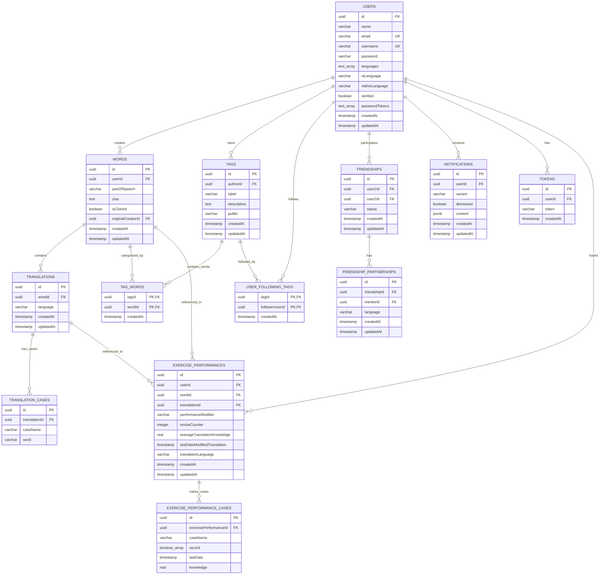

# Backend Migration Plan: MongoDB to PostgreSQL & Drizzle ORM

This document outlines the plan to migrate the **Keelapp** backend from its current Node.js/Express + MongoDB/Mongoose stack to a modern, type-safe stack using **TypeScript**, **PostgreSQL**, and **Drizzle ORM**.

---

## 1. Proposed Tech Stack

We propose the following modern, robust stack for the backend:

1. **Language**: **TypeScript**
   - *Why*: The frontend is already written in TypeScript. Bringing TypeScript to the backend ensures type safety across the entire application, reduces runtime bugs, and provides excellent IDE autocomplete.
2. **Database**: **PostgreSQL**
   - *Why*: The application's data is highly relational (Users have Words, Words have Translations, Translations have Cases, Users follow Tags, Users have Friendships). A relational database will enforce referential integrity (via foreign keys and cascades) and allow much more efficient and clean queries (using joins instead of complex MongoDB aggregation pipelines).
3. **ORM**: **Drizzle ORM**
   - *Why*: Drizzle is a lightweight, SQL-like, and extremely type-safe ORM. Unlike Prisma, it has zero-overhead, compiles to raw SQL queries, supports PostgreSQL-specific features (like native arrays `text[]` and `jsonb`), and has excellent migration tooling (`drizzle-kit`).
4. **Router/Server**: **Express** (migrated to TypeScript)
   - *Why*: To minimize migration risk and ensure we can reuse the existing Jest + Supertest suite, we will keep Express as the routing framework, but rewrite the controllers and routes in TypeScript.

---

## 2. Proposed Relational Database Schema

Below is the proposed entity-relationship design mapping the existing MongoDB Mongoose models to PostgreSQL tables.

### Schema Highlights & Refinements:
- **Normalized Translations**: In MongoDB, translations were nested arrays in the `Word` document. In PostgreSQL, we split this into a `translations` table and a `translation_cases` table. This allows fast queries, indexing on translated words, and clean foreign key relationships.
- **Friendships**: MongoDB used a `userIds` array of size 2. In Postgres, we use `user1Id` and `user2Id` with a database check constraint (`user1Id < user2Id`) to prevent duplicate friendship rows and simplify queries.
- **PostgreSQL Arrays**: We leverage PostgreSQL's native array support for `languages` (`text[]`), `passwordTokens` (`text[]`), and exercise records (`boolean[]`) to keep the schema clean where full normalization is unnecessary.
- **JSONB for Mixed Content**: The `notifications.content` field is stored as `jsonb` to easily accommodate different payload structures depending on the notification `variant`.

---

## 3. Step-by-Step Migration Plan

To ensure zero downtime, maintain code quality, and keep tests passing throughout the process, we will migrate in phases:

### ✅ Phase 1: Infrastructure & Dependencies (COMPLETE)
1. **Docker Setup**: Add a `docker-compose.yml` file to spin up a local PostgreSQL database for development and testing.
2. **Install Dependencies**:
   - Backend TypeScript dependencies: `typescript`, `ts-node`, `@types/node`, `@types/express`, `@types/bcryptjs`, `@types/jsonwebtoken`, `@types/nodemailer`, `@types/supertest`, `ts-jest`.
   - Database & ORM: `pg`, `drizzle-orm`, `drizzle-kit`, `@types/pg`.
3. **Configure TypeScript**: Add `tsconfig.json` to the backend.

### ✅ Phase 2: Schema Definition & Migrations (COMPLETE)
1. Define the Drizzle schema in `backend/src/db/schema.ts` (using the relational model defined above).
2. Set up `drizzle.config.ts` for migration management.
3. Run `npx drizzle-kit generate` to generate the SQL migration files.

### ✅ Phase 4: Test Suite Adaptation (COMPLETE)
1. Rewrite `backend/tests/db.js` to connect to a local/Docker test PostgreSQL database instead of `mongodb-memory-server`.
2. Apply migrations to the test database before running tests.
3. Keep the test suite running as we migrate each endpoint to verify we do not break any existing functionality.

### ✅ Phase 5: Incremental Code Migration
We will migrate one controller and its associated models at a time, updating the Express routes and rewriting the logic in TypeScript.

1. **User & Auth**:
   - Migrate `User` and `Token` models.
   - Rewrite `userController.js` and auth middleware in TypeScript.
   - Run `auth.test.js` and verify it passes.
2. **Tags & Follows**:
   - Migrate `Tag`, `TagWord`, and `UserFollowingTag` models.
   - Rewrite `tagController.js` in TypeScript.
   - Run `tags.test.js` and verify it passes.
3. **Words & Translations**:
   - Migrate `Word`, `Translation`, and `TranslationCase` models.
   - Rewrite `wordController.js` in TypeScript (converting complex MongoDB aggregation pipelines to type-safe Drizzle joins).
   - Run `words.test.js` and verify it passes.
4. **Friendships & Partnerships**:
   - Migrate `Friendship` and `FriendshipPartnership` models.
   - Rewrite `friendshipController.js` in TypeScript.
   - Run `friendships.test.js` and verify it passes.
5. **Notifications**:
   - Migrate `Notification` model.
   - Rewrite `notificationController.js` in TypeScript.
   - Run tests.
6. **Exercises & Performance**:
   - Migrate `ExercisePerformance` and `ExercisePerformanceCase` models.
   - Rewrite `exerciseController.js` and `exercisePerformanceController.js` in TypeScript.
   - Run `exercises.test.js` and verify it passes.

### Phase 6: Clean Up & Finalize
1. Remove Mongoose and MongoDB dependencies from `package.json`.
2. Delete the old JavaScript files and MongoDB models.
3. Update environment variables in `.env` (replace `MONGO_URI` with `DATABASE_URL`).

---

## 4. Verification Plan

### Automated Verification
- We will run the Jest test suite (`npm test`) after migrating each phase. The goal is to keep all **108 tests passing** on the new PostgreSQL backend.
- We will configure `ts-jest` to compile and run the migrated TypeScript files and tests seamlessly.

### Manual Verification
- We will start the backend server locally using the new PostgreSQL database.
- We will run the frontend and verify all main user flows (registration, login, adding words, filtering, starting exercises, adding friends) work identically.

---

## 5. Questions for the User

Before we begin the implementation, please let us know your thoughts on:
1. **TypeScript for the Backend**: Do you agree with migrating the backend to TypeScript? (Recommended, as it aligns with the frontend and makes Drizzle ORM extremely powerful).
2. **PostgreSQL Setup**: Do you have a local PostgreSQL instance installed, or would you prefer us to add a `docker-compose.yml` file to manage the database locally via Docker?
3. **Database IDs**: Do you prefer auto-incrementing integer IDs (`serial`) or UUIDs (`uuid`) for the primary keys? (UUIDs are recommended for modern APIs to avoid exposing sequential IDs).
4. **Hosting / Deployment**: Are there any specific cloud hosting constraints for the database (e.g. Supabase, Neon, AWS RDS, Vercel Postgres) that we should keep in mind?
